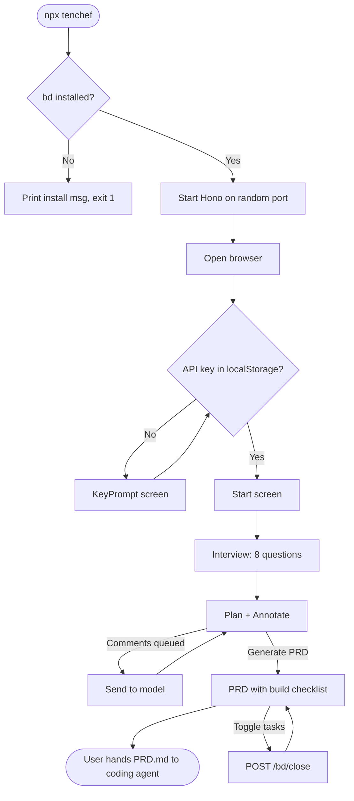
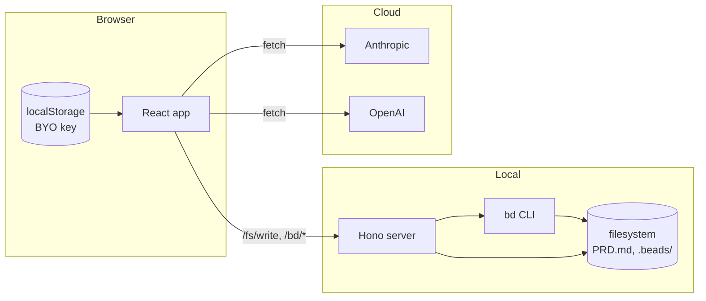

# tenchef — Product Requirements Document (v1)

## Agent Briefing

You are implementing tenchef v1. Two artifacts in this repo are authoritative:

1. **This PRD.md** — what to build, locked decisions, acceptance criteria.
2. **design/PRD Interview.dc.html** — the visual + interaction reference. Port it faithfully to a real React/TypeScript app. The design uses claude.ai's `<x-dc>` / `<sc-if>` / `<sc-for>` / `{{ ... }}` runtime; rewrite as JSX while preserving every visual choice and interaction.

Hard constraints:
- TypeScript strict, ESM, Node ≥ 20.
- Stack locked in section 4.1. Do not add a router, a state library, Tailwind, CSS-in-JS, or any schema library beyond what's listed.
- License: Apache 2.0. Package + bin name: `tenchef`.
- v1 is one tool, one binary (`npx tenchef`), three phases on screen.
- When the PRD and the design disagree, the PRD wins. Surface the disagreement.
- Final sign-off is performed by `claude -p` per section 8. The build is not done until Claude says PASS.

---

## 1. Problem Statement

Indie devs and solo founders building with AI coding agents jump from idea to "Claude Code, build this" too fast. They give the agent a vague paragraph and get back code that misses their intent — wrong scope, wrong stack, missing features. There is no structured step between "I have an idea" and "agent, go."

Tenchef inserts that step: a short visual interview, an annotatable plan, and a PRD with a live build checklist that the user hands to the coding agent.

---

## 2. Solution

A single local tool launched with `npx tenchef`. Opens a browser to a four-phase flow:

1. **Start** — landing card explaining the three-step process.
2. **Interview** — 8 fixed visual questions (text / single / multi / visual), auto-advance on choice.
3. **Plan + Annotate** — the answers become a structured plan card with 5 sections. The user toggles Comment mode, clicks anywhere on the plan to pin a comment, and clicks "Send to model" to have the LLM revise the plan based on those comments. Multiple rounds supported.
4. **PRD** — generates a render-quality PRD document with a build checklist grouped Foundation / Core features / Launch, and a live progress %.

On Generate PRD, tenchef writes `PRD.md` to the working directory and creates beads issues (one per task) via the `bd` CLI. Toggling a task checkbox in the PRD calls `bd close` / `bd update` so progress persists in beads' graph.

The user hands `PRD.md` to their coding agent. They can leave tenchef open to tick tasks done as the build progresses, or close it.

---

## 3. User Stories

Primary user: **indie dev / solo founder** building with AI coding agents.

- As an indie dev, I want to scope my idea in under five minutes before opening Claude Code, so I waste fewer tokens chasing vague specs.
- As an indie dev, I want to see my plan visually and pin comments on the parts that feel wrong, so I can revise without rewriting the whole prompt.
- As an indie dev, I want my tasks tracked in beads from the start, so my coding agent can pick up `bd ready` and I get a real audit trail.
- As an indie dev, I want a PRD I can hand to Codex or Claude Code with confidence that the build will match what I asked for.
- As an indie dev, I want to bring my own API key (no SaaS, no telemetry), so I trust the tool with my idea.

---

## 4. Implementation Decisions

### 4.1 Stack (locked)

| Concern | Choice |
|---|---|
| Language | TypeScript strict, ESM, Node ≥ 20 |
| Web frontend | Vite + React 18 + TypeScript, static build |
| State | `useReducer` mirroring the design's `this.state` shape. No router. No state-management library. |
| Styling | Inline styles, ported verbatim from the design. Shared tokens (accent, fonts, spacing constants) extracted to `src/web/styles/tokens.ts`. No Tailwind. No CSS-in-JS runtime. |
| HTTP server | Hono |
| LLM SDKs | Browser-side `fetch` against Anthropic / OpenAI messages endpoints. No provider SDKs (avoid bundle bloat). |
| Task tracker | **beads** (`bd` CLI). Required dependency — preflight check at server start. |
| Test framework | vitest |
| Distribution | npm. `bin: { "tenchef": "dist/cli/index.js" }`. |
| License | Apache 2.0 |
| Package + bin name | `tenchef` |

### 4.2 Architecture

```
src/
  cli/
    index.ts          bin entry — preflight check, start server, open browser
    preflight.ts      `bd --version` check; exit with install message if missing
    open-browser.ts   cross-platform browser launcher
  server/
    index.ts          Hono server, serves static + JSON API
    routes/
      fs.ts           POST /fs/write
      bd.ts           POST /bd/init, /bd/create, /bd/close, GET /bd/list
    beads.ts          spawn-based wrapper around `bd`
  web/                Vite app, built into dist/web/
    index.html
    main.tsx
    App.tsx           reducer + screen routing
    components/
      Start.tsx
      Interview.tsx
      Plan.tsx
      Prd.tsx
      TopBar.tsx
      Stepper.tsx
      KeyPrompt.tsx
    state/
      reducer.ts      mirrors design's state shape
      questions.ts    the 8 question definitions, lifted from design
      types.ts
    llm/
      anthropic.ts    fetch wrapper
      openai.ts       fetch wrapper
      revise.ts       sendToModel prompt builder (lifted from design)
    styles/
      tokens.ts       accent, fonts, common spacing
tests/
  unit/               reducer, prompt builder, beads wrapper
  integration/        spawn server, hit endpoints against temp .beads/
bin/
  tenchef             shebang launcher → node dist/cli/index.js
```

### 4.3 Interview (faithful to design)

Fixed 8-question sequence, exactly as defined in `design/PRD Interview.dc.html` (search for `this.QUESTIONS = [`):

1. `name` — text, "What are you building?"
2. `audience` — single, "Who is it primarily for?" (Consumers / Businesses / Internal teams / Developers)
3. `problem` — text, "What problem does it solve?"
4. `platforms` — multi, "Where should it run?" (Web / iOS / Android / Desktop / API)
5. `direction` — visual 2×2, "Which visual direction fits?" (Minimal / Editorial / Vivid / Utilitarian)
6. `features` — multi, "Must-have features for v1?" (Auth / Realtime / Notifs / Search / Analytics / Integrations / Offline / Collab)
7. `metric` — single, "What does success look like?" (Activation / Retention / Revenue / Engagement)
8. `timeline` — single, "Target for v1?" (<1 month / quarter / 6 months / no date)

Rules:
- Auto-advance 220ms after single-select and visual selection (matches design).
- Multi-select and text require explicit "Continue."
- Back from question 1 returns to Start.
- Last question's button label is "Generate plan."
- Progress bar = `(qIndex + 1) / 8`.
- **No "type your own", no "I don't know", no "skip", no technical/non-technical branching, no adaptive depth.** Honor the design.

### 4.4 Plan + Annotation (faithful to design)

Five annotatable sections rendered as a single plan card (each carries `data-annot`):

- **Header** — product name + summary sentence
- **Audience & goals** — audience label/desc, success metric, primary goals (3)
- **Platforms** — chip list with direction label
- **Feature scope · v1** — 2-column grid of features
- **Milestones** — Foundation / Core build / Launch as 3 cards

Comment mode:
- Toolbar toggle. When on: cursor → crosshair, click anywhere on the plan to open a comment popover anchored to that section (`data-annot` lookup) and the click coordinates.
- Pins render at the original coordinates with a numbered marker.
- Sidebar lists every comment with hover→highlight mapping to the section.
- "Send to model · N" submits all `!addressed` comments. Plan + comments → LLM (prompt is lifted verbatim from the design's `sendToModel`). Expected response: minified JSON with `productName, summary, goals, platforms, features, milestones, changeSummary`. Apply diff; mark all sent comments `addressed`; show green confirmation banner with the change summary.
- Multiple rounds supported — user can keep adding new comments after a revision.

### 4.5 PRD output (faithful to design)

Document layout:
- Title + date strip + meta strip (For / Platforms / Target)
- Overview (uses `summary` and a fallback paragraph if no `problem` was given)
- Goals (bullet list)
- **Build checklist** grouped Foundation / Core features / Launch, with per-task checkboxes
- Progress bar at the top of the checklist (`done / total`)
- Feedback to address — carries all comments forward as resolve-toggles
- Side rail: large progress %, "Back to plan", "Start over"

Tasks are built by `buildTasks(features, metricLabel)` (lifted from design):
- Foundation: "Set up repo, CI & environments", "Authentication & user accounts", "Design system & app shell"
- Core features: one task per selected feature
- Launch: "Wire up <metric> analytics", "QA pass & bug bash", "Launch & rollout plan"

### 4.6 Beads integration

`bd` is a hard runtime dependency. Preflight check on server start:

```
$ npx tenchef
tenchef requires beads (bd) to be installed.

Install one of:
  brew install beads
  npm i -g @beads/bd
  pipx install beads-mcp

Docs: https://github.com/gastownhall/beads
```

Exit code 1.

If `bd` is present:
- On Generate PRD click: if `.beads/` is missing in cwd, run `bd init`. Then `bd create` one issue per task, with `--type task --label tenchef --label <group>` (group = `foundation` / `core` / `launch`). Set Foundation as blocker of Core, Core as blocker of Launch (per-task dependency edges from Foundation → Core, Core → Launch).
- On checkbox toggle in the PRD view: POST `/bd/close <id>` (or reopen via `bd update <id> --status open`).
- On reload with existing `.beads/`: hydrate `state.tasks` from `GET /bd/list` so progress persists across sessions.

Beads-issue IDs are stored alongside each task in the reducer (`task.beadsId`).

`bv` is **not** required. Users who want the graph view can install and run it separately.

### 4.7 LLM provider (BYO key)

- On first launch, if neither `tenchef.apiKey` nor `tenchef.provider` is set in `localStorage`, render `KeyPrompt` before the Start screen.
- Provider toggle: **Anthropic** (default) / **OpenAI**.
- Paste key, click Save. Key is stored in `localStorage` only — never sent to any tenchef-controlled endpoint.
- All LLM calls (just `sendToModel` in v1) go browser → provider directly via `fetch`.
- Anthropic: `POST https://api.anthropic.com/v1/messages`, header `x-api-key`, model `claude-3-5-sonnet-latest` (or current equivalent — implementer picks the latest GA Sonnet).
- OpenAI: `POST https://api.openai.com/v1/chat/completions`, header `Authorization: Bearer …`, model `gpt-4o` (or current equivalent).
- Failures surface inline in the design's `revisionError` banner.

### 4.8 Distribution & CLI

- `npx tenchef [dir]` — optional positional arg sets the project directory (defaults to cwd). Output files (`PRD.md`, `.beads/`) land there.
- `--port <n>` — pin a port (default: random free port).
- `--no-open` — skip auto-open (for CI / tests).
- Server auto-shuts down after 30 minutes idle (no requests).
- Browser opens to `http://127.0.0.1:<port>`.

### 4.9 Design fidelity rules

- **Brand swap:** every literal "Scope" → "tenchef." "PRD studio" stays.
- All colors, fonts (Instrument Serif + Instrument Sans), spacing, radii, transitions match the design.
- Accent color is a prop with the same default (`#2F4FE0`) and the same option set. Exposed in v1 via a single `--accent` CLI flag.
- All `style-hover` / `style-focus` pseudo-classes are reproduced (use real CSS pseudo-classes; can centralize in a small `:hover` block per component or use inline `onMouseEnter`/`onMouseLeave`).
- The DC runtime's `sc-if` / `sc-for` placeholder hints are design-tool affordances — drop them in the React port.
- No new animations, no new screens, no extra polish.

---

## 5. Testing Decisions

Default framework: **vitest**.

**Unit:**
- `reducer.test.ts` — every state transition (start→interview→plan→prd, back/forward, comment add/delete/resolve, task toggle, revision apply, restart).
- `revise.test.ts` — the `sendToModel` prompt builder produces the exact prompt structure the design uses (snapshot test against a canned plan + comments).
- `beads.test.ts` — beads wrapper builds the right `bd` argv strings.

**Integration:**
- `server.int.test.ts` — spawn the Hono server against a temp dir, hit `/bd/init`, `/bd/create`, `/bd/close`, assert against the resulting `.beads/beads.jsonl`.
- `preflight.int.test.ts` — run `node dist/cli/index.js` with a mocked PATH that omits `bd`; assert exit code 1 + install message on stderr.

**Smoke:**
- `npm run build && node bin/tenchef --no-open --port 7777` boots; `GET /` returns 200; `GET /bd/list` returns `[]` against empty `.beads/`.

---

## 6. Out of Scope (v1)

Tenchef v1 explicitly does not:

- Ship as a skill (`SKILL.md` etc.).
- Provide an adaptive interview, glossary side output, "I don't know" / "type your own" / "skip" chips, or technical-vs-non-technical branching.
- Integrate `bv` (graph viewer is a separate user concern).
- Watch beads JSONL externally — task toggles in the PRD view only update via the in-app checkbox.
- Support iterative PRD refinement after the user closes the tool (re-run from scratch to revise).
- Support web app or mobile app project types as a first-class branch — the interview is product-agnostic.
- Persist state across tabs / devices.
- Send telemetry. Anywhere.
- Host a paid version, proxy the user's API key, or offer a managed tier.

---

## 7. Diagrams

### 7.1 Phase flow



### 7.2 Runtime topology



---

## 8. Acceptance Criteria

v1 ships when **all** of these pass:

- [ ] `npx tenchef --no-open --port 7777` starts a server on 127.0.0.1:7777 and exits cleanly on Ctrl-C.
- [ ] Without `bd` on PATH, `npx tenchef` exits with code 1 and prints the install message to stderr.
- [ ] First-load UX prompts for an API key + provider; key persists in `localStorage`.
- [ ] All 8 interview questions render with the exact options from the design; auto-advance fires only on single/visual selection.
- [ ] Plan view renders all 5 sections; comment-mode click drops a numbered pin at the click coordinates; sidebar shows the comment.
- [ ] "Send to model" calls the configured provider, applies the JSON revision, marks sent comments addressed, shows a green confirmation banner.
- [ ] "Generate PRD" writes `PRD.md` to cwd and creates one beads issue per task with the right group label and Foundation→Core→Launch blockers.
- [ ] Toggling a task in the PRD view calls `bd close` / `bd update`; the change is visible in `bd list`.
- [ ] Reloading the browser hydrates task state from `bd list` (no data loss).
- [ ] Brand: zero occurrences of "Scope" remain; wordmark reads "tenchef · PRD studio."
- [ ] Visual diff against `design/PRD Interview.dc.html` shows no unintended deviation (colors, type, spacing, layout).
- [ ] `LICENSE` (Apache 2.0) present; `package.json` has `name: "tenchef"` and a `bin` entry.
- [ ] All vitest tests pass: reducer, prompt builder, beads wrapper, server integration, preflight integration.
- [ ] **Final sign-off**: `claude -p` (per the executor's prompt) returns PASS against this PRD and the design.
